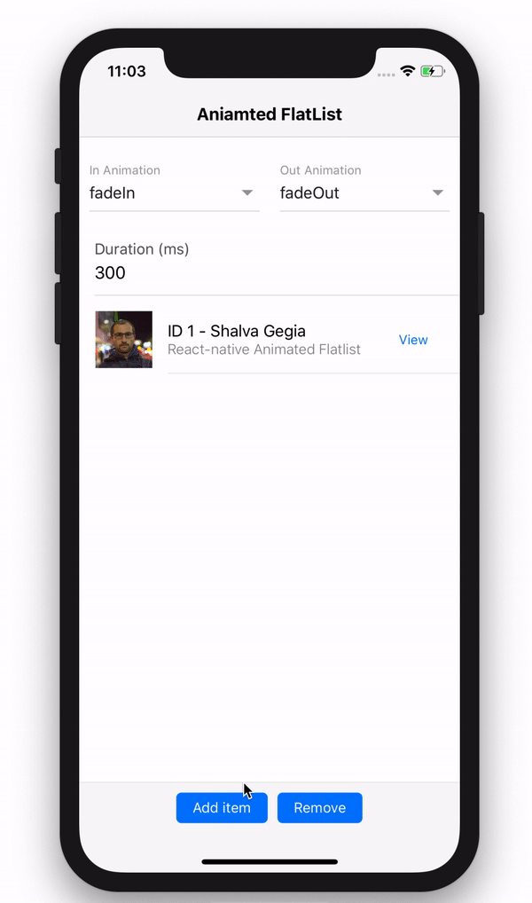

# React Native Animated Flatlist
Animated Flatlist for React-Native

[View demo on Snack](https://snack.expo.io/@shakogegia/react-native-animated-flatlist-demo)




### Install

```bash
npm i -S react-native-animated-flatlist
```
or 
```bash
yarn add react-native-animated-flatlist
```

### Usage
Import library

```js
import AnimatedFlatlist from 'react-native-animated-flatlist'
```

Usage

```jsx
<AnimatedFlatlist
  items={this.state.data.concat([])}
  id={"id"}
  inAnimation={"fadeIn"}
  outAnimation={"fadeOut"}
  duration={300}
  rowItem={({item}) => (
    <Text>Render Item...</Text>
  )}
/>
```

### Props

Name              | Type               | Description    | Default Value                                                                                                                                                                           
-------------    | ---------------------------------------- |  ---------------------------------------- |  ----------------------------------------
items  | array | Array of objects to iterate | []
id  | string | Uniq identifier property of object | -  
inAnimation  | string | Animation for newly created item (See react-native-animatable for available animations) | fadeIn
outAnimation  | string | Animation for deleted item (See react-native-animatable for available animations) | fadeOut
duration | nubmer | Animation duration  | 300
rowItem | function({item, index}) | React component to render Item with `item` and `index` params | -


Also you can use React-native Flatlist props

### Credits

https://github.com/oblador/react-native-animatable